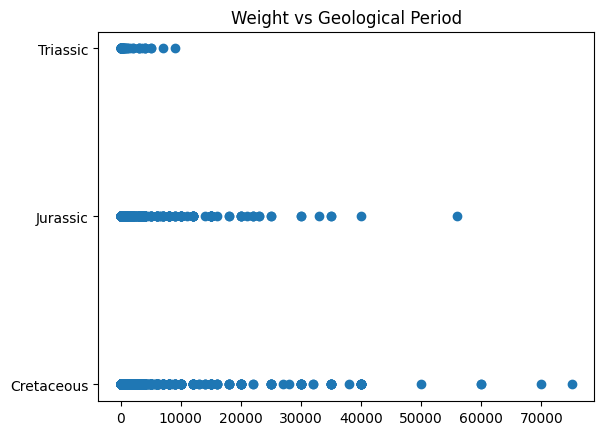
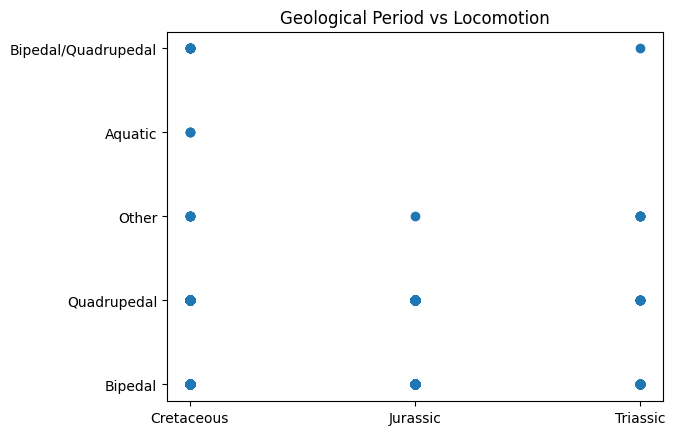
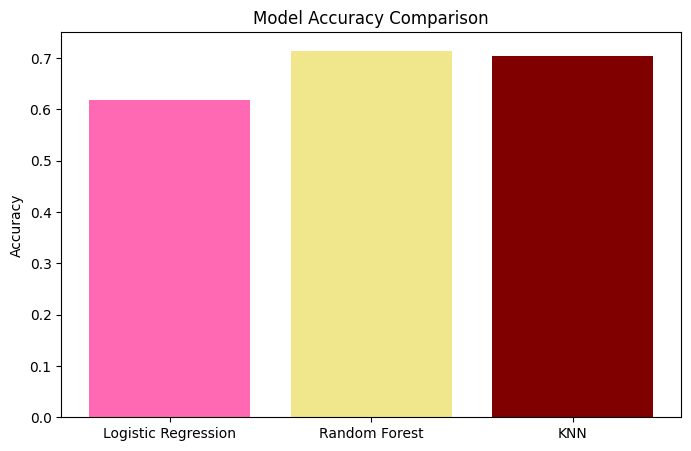
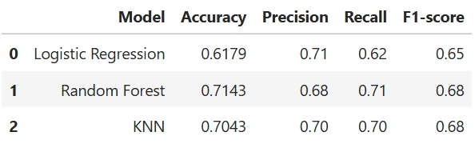

# How Old is My Dinosaur?

This repository applies machine learning to classify dinosaurs into respective geological eras based on biological and geological features from the "Dinosaur Genera" Kaggle dataset. (https://www.kaggle.com/datasets/canozensoy/dinosaur-genera-dataset)

## Overview

The task is to use a tabular dataset of 17 features for 1538 dinosaurs to train and test a machine learning model that predicts the respective geological period of dinosaurs. This study was approached by formulating an initial question, performing exploratory data analysis, feature engineering, cleaning and preprocessing the data, and training three different machine learning models, logistic regression, random forest classifier, and K-NearestNeighbor, to compare performance and identify the most influential features. Amongst the three separate machine learning models, the Random Forest Classifier scored the highest accuracy at 71.43%. 

## Summary of Work Done
------------------------------------------------------------------------------------------------------------------------------

### Data

**Data**

The dataset used in this project is a tabular dataset containing mixed numerical and categorical features. It consists of 17 attributes describing dinosaur genera, including biological characteristics and information related to fossil discovery. The goal of the model was to predict the geological period of each dinosaur based on these features. The dataset contains 1,538 unique dinosaur instances with 17 attributes each. For model training and evaluation, 1,203 samples were used for training and 300 samples were used for testing, with no separate validation set applied.

**Preprocessing/ Clean up**

At initial viewing, several categorical features contained similar but inconsistent labels, making them overly complicated and large. Features such as "locomotion" was consolidated by combining similar entries into a new feature. Once the size of the unique values were more manegable, histograms were created to see the distribution of numerical values. Outliers were handled via clipping using the IQR * 1.5 rule, and null values were dropped or filled using information online based on the excessiveness of missing information across multiple features. Non informative columns, such as index id and url, were dropped as it did not contribute to the study. As for encoding, label encoding was used to encode a new geological period feature while remaining features were one hot encoded to prepare the dataset for machine learning models.

**Data Visualization**



This is a scatter plot showing the distribution between weight and the cleaned geological periods. As seen in the graph, most of the weights are concentrated within a lower weight range indicating that most dinosaurs in the dataset are relatively small. However, there are instances were dinosaurs from the Jurassic and Cretaceous periods seemed to weigh more which suggests that dinosaurs from the Cretaceous and Jurassic era tended to be larger.



The relationship between geological period and locomotion type, both simplified, was visualized also using a scatterplot for exploratory analysis. While the Cretaceous period contained all locomotion categories represented in the dataset, the Jurassic period lacked dinosaurs that were mixed in the method of movement and aquatic. The Triassic period lacked Aquatic examples in this dataset. 

Both visualizations shared shows that there were significant diversity in the dinosaurs' biology between geological periods. 

### Problem Formulation

The input chosen for the model is a set of processed features (X) describing dinosaur characteristics, including physical attributes and categorical variables. The output (y) is the geological period classification of each dinosaur. The models selected for the project were Logistic Regression as a baseline due to its simplicity, Random Forest Classifier as it improves performance by averaging multiple decision trees, and K-Nearest Neighbor because of its ability to classify each sample based on the majority label of its neighbors. For the Random Forest Classifier, the hyperparameters included the number of trees (200) and random state for reproducibility. For K-Nearest Neighbor, the hyperparameters was the number of neighbors (5). These parameters were tuned to improve model accuracy. 

### Training

All models were trained using the scikit-learn library. The dataset was split into training and testing sets using an 80/20 split. For Logistic Regression, feature scaling was applied prior to training. This model served as a baseline. For Random Forest Classifier, each tree was trained on a random subset of the data and features. Final predictions were made by majority voting across trees. For K-Nearest Neighbor, training consisted of storing training dataset. This approach helps reduce overfitting and improves generalization performance.The training time was negligible because of the data size. Model performance was evaluated by changing the nuber of neighbors. A challenge was making sure that feature scales did not bias distance calculations and tuning hyperparameters.

### Performance Comparison

The key performance metrics measure in this project are accuracy, precision, recall and F1-score. Accuracy measures overall correctness when predicting geological era, while precision and recall evaluate if the predicted labels were actually correctly identified. F1-score provides a balanced measure between precision and recall, evaluating the overall performance.






### Conclusions

From the evaluation of the three models, the Random Forest Classifier achieved the highest overall performance for accuracy and recall scores. This suggests a non-linear relationship between features and geological periods which ensemble methods are better able to capture. Out of the three, Logistic Regression performed the lowest as the dataset is not strictly linear. 

### Future Work

In future works, a new feature for notable features could improve the accuracy. Because geological era had disparities in biological attributes of the dinosaurs, the notable features could have a major influence to predicting era. The trained model could be extended to a practical application for classifying newly discovered or unknown fossils, allowing researchers to estimate the geological period of fossils based on their features.

## How to Reproduce Results
-----------------------------------------------------------------------------------------------------------------

The instructions below douments how to reproduce results fully


### Overview of Files in Repository

* KaggleChallenge.ipynb: Main notebook containing the full code, including data loading, preprocessing, feature engineering, model training, and evaluation.
* KNN.ipynb: Trains and visualizes the K-Nearest Neighbot Classifier model
* Logistic_Regression.ipynb: Trains and visualizes the Logistic Regression model
* Performance.ipynb: Loads and compares the evaluation results of all trained models
* Random_Forest.ipynb: Trains and visualizes the Random Forest Classifier model
* dinoDatasetCSV.csv: Original dataset downloaded from Kaggle

### Software Setup

The project was developed using Python and the following libraries:

* pandas
* numpy
* matplotlib
* scikit-learn

These packages could be installed using:
pip install pandas numpy scikit-learn matplotlib

Key scikit-learn tools used:
- Data preprocessing: SimpleImputer for handling missing values, Pipeline and make_pipeline for structuring preprocessing and model workflows
- Modeling: LogisticRegression, RandomForestClassifier, and KNeighborsClassifier
- Evaluation metrics: accuracy, F1-score, classification report, and confusion matrix
- Model evaluation tools: confusion matrix display and permutation importance for feature analysis

### Data

Download the dataset from Kaggle:
https://www.kaggle.com/datasets/canozensoy/dinosaur-genera-dataset

**The following preprocessing steps were applied:**

- Categorical features with many unique or similar values were simplified by grouping related categories into new consolidated features.

- Missing values were handled by removing rows with excessive missing data or entering information when approrpriate (Achillobator weight).

- Numerical outliers were treated using the IQR * 1.5 rule and clipping.

- Non-informative columns such as identifiers (index IDs, URLs) were dropped.

- The target variable (geological period) was label encoded, while categorical input features were encoded using one-hot encoding.

### Training

To train the data, open the Jupyter notebook within the Repository and sequentially run all cells.

Training included: 
- Loading the dataset
- Preprocessing (missing values, outlier treatment, encoding non numerical values, scaling)
- Splitting the dataset into training and test (80/20 respectively)
- Fitting the machine learning models (Logistic Regression, KNN, and Random Forest)

**Performance Evaluation**

Performance evaluation could be run in the Performance.ipynb notebook by running the cells in sequential order.

This notebook:

- Loads predictions from the trained models
- Computes evaluation metrics including accuracy, precision, recall, and F1-score
- Summarizes results in a comparison table and visualization (accuracy bar chart)

## Citations
------------------------------------------------------------------------------------------------------------------------------

Achillobator data: https://en.wikipedia.org/wiki/Achillobator

Scikit-learn Documentation (User Guide):
https://scikit-learn.org/stable/user_guide.html


```python

```
